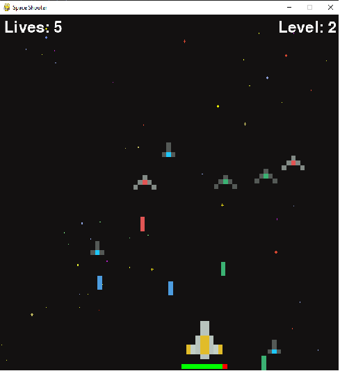
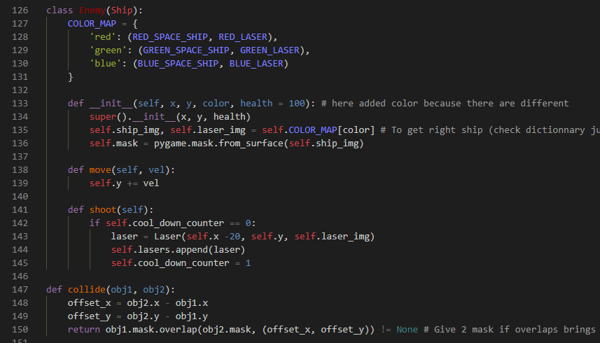

# Space_invader_Python

- Repository: `Learning Python`
- Type of challenge:  `Learning new Possibilities`
- Duration: `1 day`

## My Project
This little Saturday project is an old fun game, a space invader. I did this with the help of pygame to get better at python and to make a second game with it.
This is one of my first projects in python and is strongly inspired from a youtube video.  
The goal of the game is to destroy all incoming spaceships with your lasers and don't get hit.
inspired from: https://www.youtube.com/watch?v=Q-__8Xw9KTM&t=5790s&ab_channel=TechWithTim

## Instructions to test the game
- Open the 'Space_invader_Python_DL.exe' file
- Download it, accept the antivirus messages.
- Then choose were you want to install the game.
- It will install a folder and in the folder there is a 'main.exe' file, open it.
- You might need to turn off the antivirus temporarily.
- You can then play the game and will hopefully enjoy it! ;)

## The Game 

## My Code

### Hope you enjoy it! 

